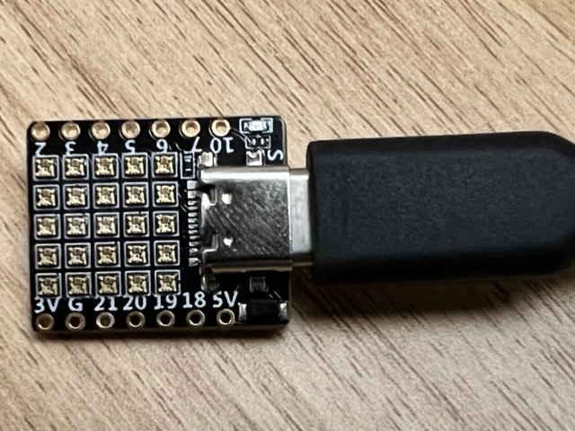
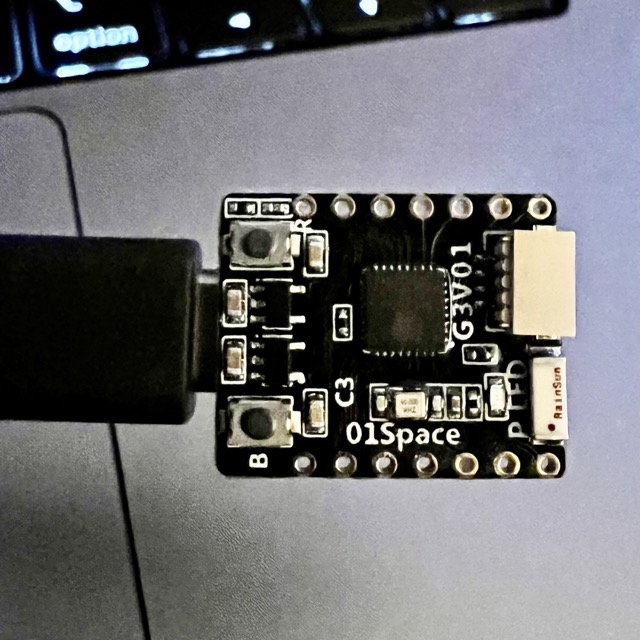

# "Five by Five"

Multilingual code for a [01Space](https://github.com/01Space) 5x5 Neopixel RISC V board (ESP32-C3FH4 with USB-C) - sometimes called a "bedazzled" or "bejazzled" ESP32-C3!

## Background

It all started with [this Tweet from @GeekMomProjects](https://twitter.com/GeekMomProjects/status/1479210241807900676)...

This repo started as a set of MicroPython experiments. The goal of this project *now*, is to aggregate information, and different examples, to enable the community to learn about and use the ESP32-C3FH4-RGB board.

## Requirements

- the board, available to purchase [via Banggood](https://banggood.com/ESP32-C3-Development-Board-RISC-V-WiFi-Bluetooth-IoT-Development-Board-Compatible-with-Python-p-1914005.html)
  - a USB-A to USB-C data cable *will not work with USB-C to USB-C*

## Contents

- `arduino/` updated version of the original Arduino code for the board (may need to populate via `git pull --recurse-submodules`). This pulls in my fork of the upstream original project so that I can send updates as needed.
- [`micropython/`](./micropython) MicroPython code examples.
- [`tinygo/`](./tinygo) TinyGo code examples.

Each language subdirectory contains more information specific to build and usage of the code.

- [`images/`](./images) various images to illustrate functionality and the board itself
- [`reference/`](./reference) annotated images and schematics. The included schematic diagram has been kindly supplied by Jiale Xu of 01Space (this is also available in the original Arduino project)

### More information

- various learnings in the [notes](notes.md)
  - good source of information on what works / is broken
  - many todos and ideas listed, contributions welcomed!
  - will be organised into a GH wiki soon...
- [YouTube playlist](https://www.youtube.com/watch?v=SQO4Dn0vE3k&list=PLBlxSZoETPB-GN-FPKTdkK5IxIUz5LEIO) showing some of these samples

### Images

More images in [`images/`](./images), PDF/JPEG reference cards and schematic in [`reference/`](./reference)

## License

MIT License Copyright (c) 2022 Andy Piper; some code samples may carry alternative licenses.

## Contributing

If you'd like to get involved or ask questions, please use the [Discussions](https://github.com/andypiper/fivebyfive/discussions).

For code and documentation, see [Contributing](./CONTRIBUTING.md), and follow the [Code of Conduct](.github/CODE_OF_CONDUCT.md). Thanks!
