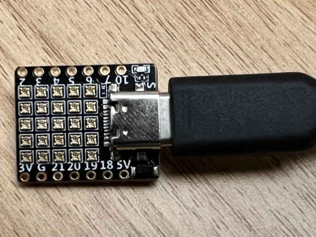

# "Five by Five"

MicroPython code for a 01Space 5x5 Neopixel board (ESP32-C3 with USB-C)

It all started with [this Tweet from @GeekMomProjects](https://twitter.com/GeekMomProjects/status/1479210241807900676)...

## Requirements

- board from [here](https://banggood.com/ESP32-C3-Development-Board-RISC-V-WiFi-Bluetooth-IoT-Development-Board-Compatible-with-Python-p-1914005.html)
- MicroPython build from [here](https://micropython.org/download/esp32c3-usb/)

More information / learnings in the [notes](notes.md)
